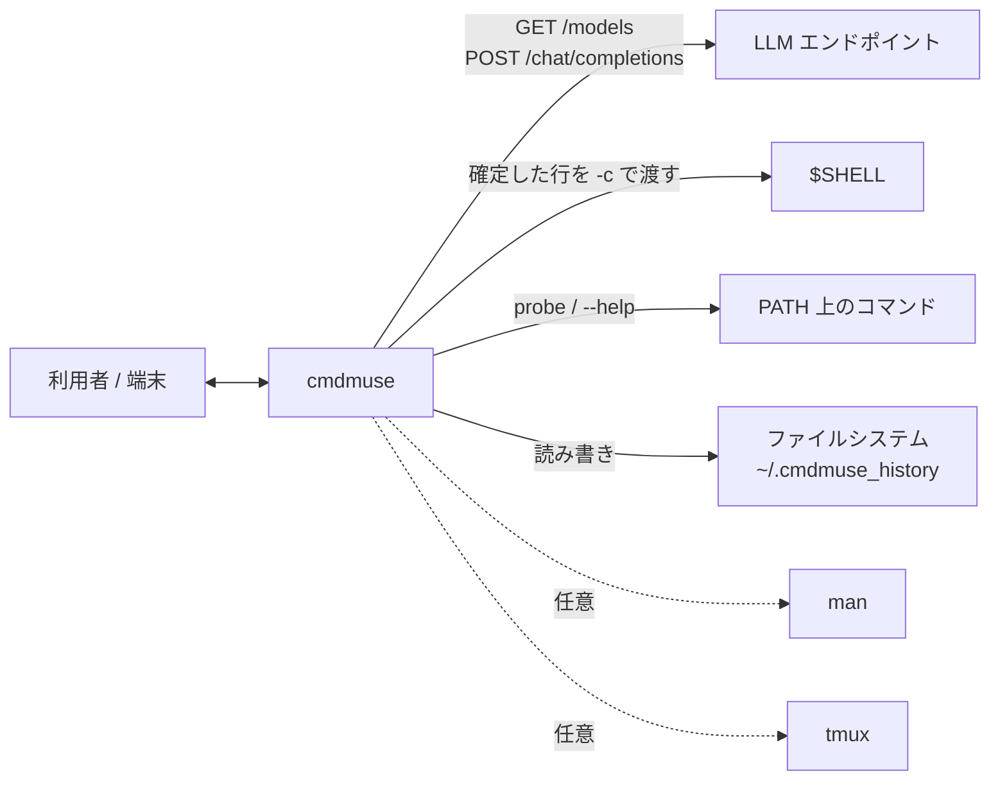
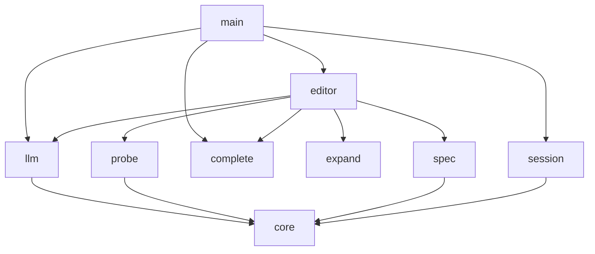
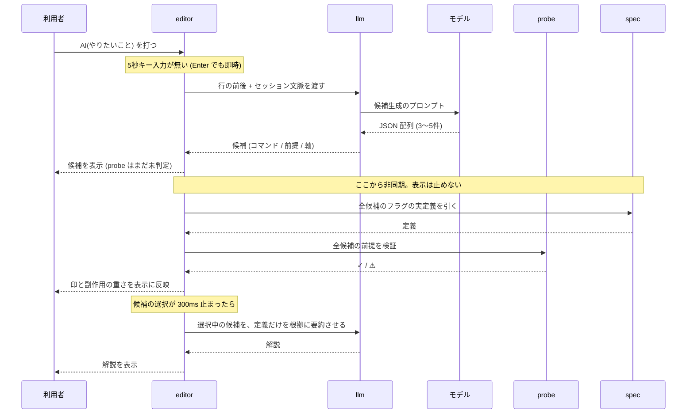

# cmdmuse 設計書

2026-09-05 時点の実装を対象とする。
構成は [arc42](https://arc42.org/overview/) の抜粋。
開発の進め方は [CONTRIBUTING.md](../CONTRIBUTING.md) を参照。

---

## 1. 目的と品質目標

### 1.1 目的

シェルの行の中に `AI(やりたいこと)` と書くと、その部分だけが実際に動くコマンドに置き換わる。
行の前後はそのまま残るので、パイプの途中にも書ける。

```
cmd> cat server.log | AI(直近のエラーだけ抜き出したい) | less
cmd> cat server.log | grep -i error | tail -20 | less
```

### 1.2 品質目標

優先順位を付けてある。競合したときは上を採る。

| 順 | 品質 | なぜこの順位か |
|---|---|---|
| 1 | **安全性** | モデルが書いた文字列を cmdmuse が自動実行する箇所がある。ここで破壊的な操作が一度でも走れば、cmdmuse は使い物にならないと判断され、存在意義を失う |
| 2 | **応答時間** | 「手が止まって5秒で候補が出る」ことが利用体験の前提。待たされるならシェルを直接使ったほうが速い |
| 3 | **説明の正確さ** | フラグの説明が誤っていると、利用者は確認したつもりで誤ったコマンドを実行する。無説明より害が大きい |
| 4 | **移植性** | Linux / Windows / macOS で同じ単一バイナリが動くこと |

---

## 2. 制約

設計で動かせない前提。

| 制約 | 内容 | 由来 |
|---|---|---|
| 単一バイナリ | 実行時ランタイムも設定ファイルも要求しない | 要件 |
| ログインシェルを置き換えない | cmdmuse は `$SHELL` の前段に立つだけ。確定した行は `$SHELL -c` に渡して実行する | 要件 |
| OpenAI 互換 API のみ | 使うのは `GET /models` と `POST /chat/completions` の2つ | ローカルのサーバーでもクラウドでも動かすため |
| モデル固有機能を使わない | tool calling / structured output / ストリーミングは使わない | 同上 |
| シェルを補助に使わない | 補完も probe (用語集参照) も、編集中の行や生成物をシェルに渡さない | 品質目標1 |
| 画面を占有しない | 端末の代替画面バッファに入らない | 実行結果が通常のシェルと同じようにスクロールバックへ残る必要がある |
| 処理内で実行するコマンドは副作用がないもの | `--help` / `man` / probe / `tmux capture-pane` | 品質目標1 |

---

## 3. コンテキストと範囲

### 3.1 外部との境界



| 相手 | 向き | やりとりする内容 | 必須 |
|---|---|---|---|
| 利用者 / 端末 | 双方向 | キー入力と画面表示 | 必須 |
| LLM エンドポイント | 送受信 | HTTP。起動時の疎通確認とモデル名解決、候補生成 / 解説 / 深堀り | 必須 |
| `$SHELL` | 起動 | 確定した行。端末をそのまま渡すので `vim` や `less` も動く | 必須 |
| ファイルシステム | 読み書き | 補完のためのディレクトリ読み取り、履歴の読み書き | 必須 |
| `PATH` 上のコマンド | 起動 | probe の実行、`--help` の取得 | 必須 |
| `man` | 起動 | フラグ定義の取得。無ければ `--help` だけで済ませる | 任意 |
| `tmux` | 起動 | `capture-pane` で直前の画面を取る。無ければ履歴ファイルで代替 | 任意 |

### 3.2 範囲外

- シェルの初期化ファイル (`.bashrc` 等) の読み込みと、エイリアス・シェル関数の解釈
- ジョブ制御 (`&`、`fg`、`bg`、`Ctrl+Z`)
- 会話の永続化。問い合わせは1回ごとに独立している
- モデルの学習・微調整

環境変数は継承される。cmdmuse は実行するコマンドの環境を差し替えないので、
`echo $HOME` は通常どおり動く。一方、確定した行は `$SHELL -c` で非対話・非ログインとして
起動するため初期化ファイルが読まれず、エイリアスとシェル関数は効かない。
行の中で `export FOO=1` しても子プロセスの中だけで、次の行には残らない。

---

## 4. 解決戦略

品質目標ごとに、何を選んだか。

| 品質目標 | 取った方針 |
|---|---|
| 安全性 | モデルの出力を「cmdmuse が自動実行する文字列 (probe)」と「利用者が選んで実行する文字列 (候補)」に分ける。前者は許可リストで実行範囲を限定し、後者は `Enter` を経ずに実行しない |
| 応答時間 | 生成以外で待たせない。`PATH` の走査は起動直後に先読みし、probe は候補を表示してから非同期で走らせ、補完は `tea.Cmd` で入力処理と分離する |
| 説明の正確さ | モデルに知識を出させない。`--help` と `man` から取った実定義を入力に注入し、要約だけをさせる |
| 移植性 | cgo と外部ランタイムを使わない。OS 差は実行シェルの分岐 (`$SHELL` / `powershell.exe`) と `internal/session` の取得元だけに閉じ込める |

---

## 5. 構成要素

### 5.1 依存関係



- `core` は共有する型だけを持ち、他の `internal` を参照しない
- `editor` 以外のパッケージは互いを知らない。組み合わせるのは `editor` と `main` の役目
- `complete` と `expand` は `core` にも依存しない (文字列だけを扱う)

### 5.2 責務

| パッケージ | 責務 | 主な入口 |
|---|---|---|
| `main` | REPL ループ。1行読む → `cd` / `exit` を自前で処理 → 残りを `$SHELL` に渡す | `main()`, `runInShell()` |
| `internal/editor` | 行エディタ。bubbletea を代替画面なしで動かし、候補・補完・履歴・深堀りを1行の下に描く | `Model`, `Result` |
| `internal/expand` | 行の中から `AI(...)` を切り出す。引用符と入れ子の括弧を解釈し、閉じていなければ切り出さない | `Find()`, `Replace()`, `HasMarker()` |
| `internal/llm` | モデルへの問い合わせ。候補生成 / 解説 / 深堀りの3種類のプロンプトと、応答 JSON の復元 | `New()`, `Client.Probe()`, `Client.Candidates()`, `Client.Explain()`, `Client.Followup()` |
| `internal/probe` | probe の実行 (許可リスト方式) と、候補コマンドの副作用の静的判定 | `NewRunner()`, `Runner.RunAll()`, `Classify()` |
| `internal/spec` | `--help` と `man` を実行して統合し、フラグの実定義を取り出す | `NewLookup()`, `Lookup.Annotate()`, `Split()` |
| `internal/complete` | 補完の候補を作る。`PATH` の走査とディレクトリの読み取りだけを使う | `Complete()`, `WarmPathCache()` |
| `internal/session` | 直前のシェル操作を集める。tmux → PSReadLine → 履歴ファイル → 無し、の順に試す | `Capture()` |
| `internal/core` | パッケージ間で共有する型 | `Candidate`, `Precond`, `RiskLevel`, `SessionContext` |

---

## 6. ランタイム

### 6.1 `AI(...)` の展開



候補は検証を待たずに先に表示する。検証の完了を待つと、体感の待ち時間が生成時間ぶん延びる。

定義の取得・副作用の判定・probe の実行は1本の非同期処理にまとめてある (`enrichCmd`)。
解説だけは別で、候補の選択が 300ms 止まってから投げる。
`Tab` で候補を素早く送っている間に毎回投げると、使われない解説の生成が積み上がる。

### 6.2 補完

1. 利用者が `AI(...)` を含まない行を打つ
2. `editor` が `tea.Cmd` で `complete.Complete()` を呼ぶ (入力処理は止めない)
3. 結果が返ると、カーソルが行末にある場合だけ続きを薄い色で表示する
4. `Tab` で候補を送り、選択中のものが白く表示される (行にはまだ入っていない)
5. `Enter` で行に取り込む。実行はしない。もう一度 `Enter` で実行

取り込みを2段階に分けているのは、外れた提案を `Esc` で捨てられるようにするため。

### 6.3 行の実行

1. `Enter` で行が確定する
2. `main` が履歴に積む
3. `exit` / `quit` なら終了、`cd` なら `os.Chdir` で自分が移動する
   (子プロセスで `cd` しても親には効かないため)
4. それ以外は `$SHELL -c <行>` (Windows は `powershell.exe -NoProfile -Command <行>`)
   標準入出力を継承するので、対話的なコマンドもそのまま動く

---

## 7. 配置

| 項目 | 内容 |
|---|---|
| 形態 | 単一の実行ファイル。cgo 無し、外部ランタイム無し |
| 対応構成 | `linux/amd64` `linux/arm64` `windows/amd64` `darwin/amd64` `darwin/arm64` |
| ビルド | `go build -trimpath -ldflags="-s -w" ./...` (Go 1.27 以上) |
| 常駐 | 無し。起動から終了までが1プロセス |
| 権限 | 昇格しない。利用者の権限で動く |
| ディスク上の状態 | `~/.cmdmuse_history` のみ (パーミッション `600`、末尾2000件) |
| 設定ファイル | 無し。設定は環境変数だけ |

---

## 8. 横断的関心事

### 8.1 安全性

cmdmuse の中には、モデルが書いた文字列が3系統ある。扱いを分けている。

| 系統 | 誰がいつ実行するか | 守り方 |
|---|---|---|
| **probe** | cmdmuse が自動で。利用者の確認を挟まない | 許可リストで実行範囲を限定 ([ADR-1](./adr/0001-probe-allowlist.md)) |
| **候補のコマンド** | 利用者が選んで `Enter` を押したときだけ | 自動実行しない。副作用の重さを `[書き込み]` / `[破壊的]` として選ぶ前に見せる |
| **解説の文章** | 実行しない (表示のみ) | 実定義だけを根拠にさせる ([ADR-3](./adr/0003-inject-flag-definitions.md)) |

編集中の行も、補完のためにシェルへ渡すことはない ([ADR-2](./adr/0002-no-compgen.md))。

### 8.2 エラー処理

失敗の種類ごとに、どこで止めるかを変えている。

| 失敗 | 扱い |
|---|---|
| 起動時に LLM へ接続できない | 標準エラーに理由と `CMDMUSE_BASE_URL` の指定方法を出して終了 (exit 1) |
| 候補生成に失敗した | 行の下に `✗ <理由>` を出す。**打った行は消さない** |
| モデルの応答が JSON でない | コードフェンスや前後の地の文があれば取り除く。途中で切れた配列は、閉じている要素だけを救出する |
| probe が失敗 / 実行できない | 候補は消さない。`⚠` を付けて理由を下に出し、選択はできるままにする |
| フラグの実定義が取れない | 「取得できませんでした」と書かせる。推測させない |
| セッション文脈が取れない | `Source="none"` として文脈なしで続行する |

### 8.3 応答時間の設計

| 待つもの | 上限 | 理由 |
|---|---|---|
| `AI(...)` を打ってから展開開始まで | 5秒 | 打ち終わりの判定。`Enter` で待たずに開始できる |
| 起動時の疎通確認 | 15秒 | 起動を長く止めない |
| 候補生成 / 深堀り | 120秒 | 生成そのもの。`Ctrl+C` で中断できる |
| 解説 | 90秒 | 同上 |
| probe 1件 | 4秒 | 候補5件ぶん走らせても表示を止めない |
| 定義取得 + 副作用判定 + probe 全件 | 20秒 | 上の合計に上限を置く |
| `--help` / `man` 1回 | 3秒 | 応答しないコマンドで止まらないため |
| セッション文脈の収集 | 全体8秒 / 1コマンド3秒 | 起動を止めないため |
| 解説を始めるまでの猶予 | 300ms | 候補を素早く送っている間は解説を投げない |

`PATH` の走査は起動直後に別の goroutine で先読みする。最初のキー入力でこれを待つと、
`PATH` の項目が多い環境 (WSL から Windows 側の `PATH` を継承した場合など) で
数秒間キー入力が固まる。

### 8.4 並行性

非同期の処理はすべて bubbletea の `tea.Cmd` として投げ、結果は `Update` にメッセージとして返る。
`Model` は世代番号 `seq` を持ち、行が変わるたびに進める。返ってきた結果の `seq` が
現在と違えば捨てる。これで、古い問い合わせの結果が新しい行を上書きすることを防ぐ。

`tea.Cmd` を返す関数は値レシーバで書く。`return m, m.someCmd(...)` は `m` を先に複製するため、
ポインタレシーバで書き込んでも失われる。キャンセル関数は戻り値で返している。

---

## 9. アーキテクチャ決定

アーキテクチャ決定記録は [docs/adr](./adr/) を参照。1件1ファイルで、
状況 / 決定 / 検討した代替案 / 結果 の順に書いてある。

| 番号 | 決定 |
|---|---|
| [ADR-1](./adr/0001-probe-allowlist.md) | probe をシェルに通さず、許可リストで実行する |
| [ADR-2](./adr/0002-no-compgen.md) | 補完を compgen に委ねない |
| [ADR-3](./adr/0003-inject-flag-definitions.md) | フラグの実定義を注入し、要約だけをさせる |
| [ADR-4](./adr/0004-no-alternate-screen.md) | 端末の代替画面に入らず、行エディタとして動く |
| [ADR-5](./adr/0005-strategy-label-dedup.md) | 候補の重複判定に「コマンド名 + サブコマンド + 最初のフラグ」を使う |
| [ADR-6](./adr/0006-no-printable-keys-for-actions.md) | 行に打てる文字を操作キーに割り当てない |
| [ADR-7](./adr/0007-staged-ctrl-c.md) | `Ctrl+C` は状態によって捨てる範囲を変える |
| [ADR-8](./adr/0008-line-fragment-only.md) | モデルには行の断片だけを書かせる |

---

## 10. 品質要件

品質目標を、確かめられる形にしたもの。

| # | 品質 | シナリオ | 現状 |
|---|---|---|---|
| Q1 | 安全性 | モデルが probe として `rm -rf /` を返しても、実行に到達しない | `TestRejectsDangerous` の26パターンで固定 |
| Q2 | 安全性 | 候補が `[破壊的]` でも、利用者が `Enter` を押すまで実行されない | 実装で保証 (実行経路は `main.go` の確定後のみ) |
| Q3 | 安全性 | どんな文字列を打った状態で `Tab` を押しても、何も実行されない | [ADR-2](./adr/0002-no-compgen.md)。シェルに渡す経路が無い |
| Q4 | 応答時間 | キー入力が、生成や `PATH` 走査で待たされない | 起動時の先読みと `tea.Cmd` による分離 |
| Q5 | 応答時間 | 手が止まってから候補が並ぶまで 5秒 + 生成時間 | 生成時間はモデル依存。**自動計測は無い** |
| Q6 | 説明の正確さ | 定義が取れなかったフラグに、意味が書かれない | プロンプトで指示。**自動検証は無い** |
| Q7 | 移植性 | 5構成でビルドが通る | CI (`.github/workflows/ci.yml`) |

---

## 11. リスクと技術的負債

| # | 内容 | 影響 | 現状 |
|---|---|---|---|
| R1 | probe の許可リストは人が保守する。副作用のあるコマンドを足すと防御が崩れる | 高 | CONTRIBUTING で確認を義務付け。`probe_test.go` で回帰を防ぐ |
| R2 | 候補コマンドの危険度判定 (`internal/probe/risk.go`) はコマンド名とサブコマンドの表に依存する。表に無いものは `[書き込み]` も `[破壊的]` も付かない | 中 | 未対応。表示が控えめに外れる方向なので、実行の安全性には影響しない |
| R3 | `internal/editor` と `internal/session` にテストが無い | 中 | 未対応 |
| R4 | 履歴 `~/.cmdmuse_history` は平文。パスワードを含む行も残る | 中 | パーミッション `600` のみ。除外規則は無い |
| R5 | モデルの応答が JSON でないときの回復は、プロンプトと後処理に依存する | 中 | 途中で切れた配列の救出のみ実装 |
| R6 | `--help` と画面下部のヒント行が、実装の無い `1-9` / `←→` を案内している | 低 | [#6](https://github.com/gimenorum/cmdmuse/issues/6) |
| R7 | `Ctrl+D` が「行が空のとき終了」であることを、起動メッセージと `--help` が書いていない | 低 | [#3](https://github.com/gimenorum/cmdmuse/issues/3) |
| R8 | プロンプトに作業ディレクトリが出ない | 低 | [#5](https://github.com/gimenorum/cmdmuse/issues/5) |
| R9 | `PATH` の項目が多い環境で走査に数秒かかる (WSL から Windows 側の `PATH` を継承した場合など) | 低 | 起動時の先読みで隠している。走査そのものは速くなっていない |

---

## 12. 用語集

| 用語 | 意味 |
|---|---|
| **候補** | `AI(...)` 1回の問い合わせに対してモデルが返すコマンドの案。画面に3〜5件並び、利用者が1件を選ぶ |
| **probe** | 候補が使えるかどうかを確かめるための短いコマンド。モデルが候補と一緒に書き、**cmdmuse が利用者に断らずに実行する**。例: `git rev-parse --git-dir`、`command -v rename` |
| **前提条件 (Precond)** | 候補が成立するために満たされている必要がある条件と、それを確かめる probe の組 |
| **戦略ラベル (Strategy)** | 候補どうしが同じアプローチかどうかを判定するためのラベル。重複排除に使う |
| **軸 (Axis)** | 候補が他の候補とどこで違うかを一語で表したもの。画面の右端に出る (例: 再帰的、組み込み、専用ツール) |
| **補完** | `AI(...)` を使わずに普通のコマンドを打っているとき、コマンド名やパスの続きを cmdmuse が推測して薄く表示するもの。モデルには問い合わせない |
| **セッション文脈** | 直前のシェル操作。tmux の画面、PSReadLine の履歴、シェルの履歴ファイルのいずれかから取り、候補生成の入力に混ぜる |
